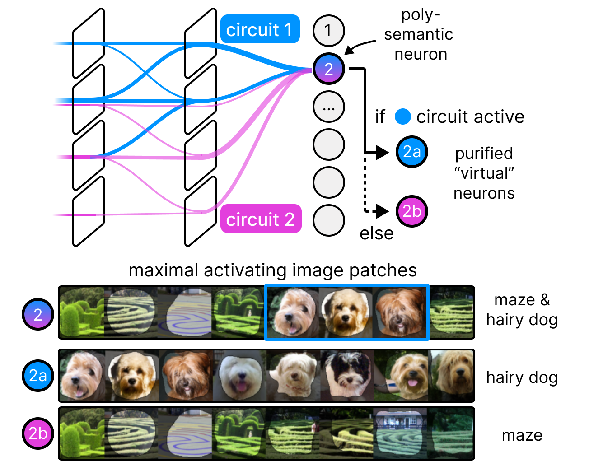

<div align="center">

<h1>PURE: Turning Polysemantic Neurons Into Pure Features by Identifying Relevant Circuits</h1>
<p>
PyTorch Implementation</p>
</div>

## Description

This repository contains the code for the paper "**PURE: Turning Polysemantic Neurons Into Pure Features by Identifying Relevant Circuits**'' accepted at the XAI for Computer Vision Workshop (XAI4CV) at CVPR 2024 as a spotlight.

<div align="center">

</div>

### Abstract 

The field of mechanistic interpretability aims to study the role of individual neurons in Deep Neural Networks.
Single neurons, however, have the capability to act polysemantically and encode for multiple (unrelated) features, which renders their interpretation difficult.
We present a method for disentangling polysemanticity of any Deep Neural Network by decomposing a polysemantic neuron into multiple monosemantic "virtual" neurons.
This is achieved by identifying the relevant sub-graph ("circuit") for each "pure" feature.
Our approach allows us to find and disentangle various polysemantic units of ResNet models trained on ImageNet.
While evaluating feature visualizations using CLIP, our method effectively disentangles representations, improving upon methods based on neuron activations.

## Table of Contents

  - [Description](#description)
  - [Table of Contents](#table-of-contents)
  - [Installation](#installation)
  - [Config Files](#config-files)
  - [Preprocessing](#preprocessing)
  - [Render UMAP and Feature Visualizations for PURE](#render-umap-and-feature-visualizations-for-pure)
  - [Evaluate Interpretability of Disentangled Features](#evaluate-interpretability-of-disentangled-features)
  - [Evaluate Alignment to CLIP](#evaluate-alignment-to-clip)
  - [Citation](#citation)

## Installation

We use Python 3.8.10. To install the required packages, run:

```bash 
pip install -r requirements.txt
```

Secondly, we need to download the **ImageNet** dataset. To do so, visit
the [ImageNet website](https://image-net.org/download.php) and download the training and validation images.

### Config Files

Please adapt the config files to your setup (e.g., correct dataset paths).
To do so,
specify the config files in `configs/imagenet/*.yaml` (replace `*` with model name):

## Preprocessing

In order to begin with the experiments,
we first need to collect the max-activating image patches using the [CRP repository](https://github.com/rachtibat/zennit-crp).
Secondly, we precompute latent activations and relevances, which, for instance, will be used for finding circuits.
Afterwards, we precompute CLIP and DINOv2 embeddings on the feature visualizations.
The whole pre-processing pipeline can be run as follows:

```bash
bash scripts/run_preprocessing.sh
```

## Render UMAP and Feature Visualizations for PURE

In the first part of the experimental section,
we visualize UMAP embeddings of PURE attributions and show the feature visualizations for each virtual neuron.
To do so, run:

```bash
python -m experiments.plotting.plot_neurons --config_file "config_files/YOUR_CONFIG.yaml" --neurons $neurons
```
where `$neurons` is a list of neurons to visualize, e.g., '201,2,341,422,21'.

## Evaluate Interpretability of Disentangled Features

As a first evaluation experiment,
we compute CLIP embedding distances between the feature visualizations for clusters of different methods. 
To do so for all models and number of clusters, run:

```bash
bash scripts/run_evaluation.sh
```

## Evaluate Alignment to CLIP

In the second evaluation experiment,
we evaluate the alignment of PURE, DINOv2 and activations to CLIP.
We therefore compute the correlation between distances of embeddings for feature visualization pairs.
To do so, run the jupyter notebook `experiments/disentangling/distance_correlation.ipynb`.

## Citation

Please feel free to cite our work, if used in your research:

```bibtex
@article{dreyer2024pure,
  title={PURE: Turning Polysemantic Neurons Into Pure Features by Identifying Relevant Circuits},
  author={Dreyer, Maximilian and Purelku, Erblina and Vielhaben, Johanna and Samek, Wojciech and Lapuschkin, Sebastian},
  journal={arXiv preprint arXiv:2404.06453},
  year={2024}
}
```